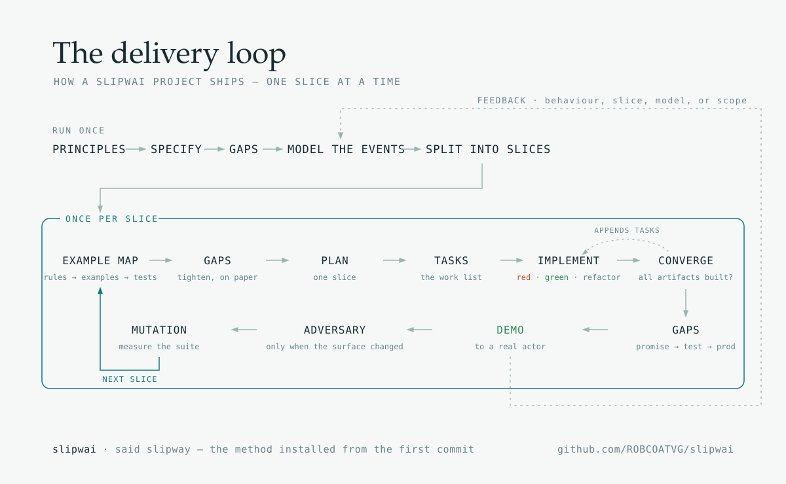

# Slipwai

[](https://pypi.org/project/slipwai/)
[](LICENSE)

The canonical source is
[git.treyco.dev/ROBCOATVG/slipwai](https://git.treyco.dev/ROBCOATVG/slipwai).
[GitHub](https://github.com/ROBCOATVG/slipwai) is the public mirror and the
place to report issues and propose changes.

## New to this — start here

Two learning paths. Each starts with **installing the command**, walks the first session with terminal
screenshots, then shows how to **update** `slipwai`, **migrate** a project when the factory moves, and
**catch up** — `/catch-up` is the work a merge cannot finish.

| Path | When |
|---|---|
| **[Generate a new project](docs/learn-generate.md)** | You want a fresh repository — walking skeleton, gate, delivery method — from a few answers |
| **[Adopt an existing repository](docs/learn-adopt.md)** — experimental | You already have a codebase; install the method *around* it without rewriting it first |

You do not clone this repository to scaffold or adopt a product. Install once, then `slipwai generate` or
`slipwai adopt`.

---

One-shot scaffolder for new product monorepos, and the ramp they leave from: *slipwai* is said *slipway*,
the slope a finished hull slides down into the water, after which the yard has nothing more to do with it.
Answer a few questions and you get a fresh Git repository containing a walking skeleton, an executable test,
a `verify` gate that runs locally and in CI, and a complete delivery method — Spec Kit, up to 49 skills, fifteen
workflow commands, a global event model that renders itself, and generated documentation — set up for coding
agents to work in from the first commit.

```sh
slipwai generate            # answer a few questions → a fresh Git repo, one commit, on main
cd ledger && ./init         # Spec Kit + your coding agent, on demand
make verify                 # the gate, the same one CI runs
```

**Jump to** — [New to this](#new-to-this--start-here) · [What it is](#what-it-is) ·
[Getting started](#getting-started) · [What you get](#what-you-get) ·
[The answers you give](#the-answers-you-give) · [Documentation](#documentation)

---

## What it is

A factory. **A generated project owns every one of its files** and may rename, replace or delete any of
them: nothing is stamped factory-owned, there is no manifest of files it may not touch, and the factory
never reaches in to overwrite. That is what makes the skeleton safe to edit on day one.

It is not a one-way door, though. The factory is designed to be run again *inside* a project it made:
`slipwai add-service` and `slipwai add-frontend` read `project.json` and regenerate exactly the files that
list a project's applications, deriving that set by generating the project twice and diffing, so it can
never drift from a hand-kept list. `./init` re-answers the event store, HTTP, staff and customer identity
axes by pruning what they brought. Both respect what the project has become rather than what it was
generated from.

Later improvements reach a project the same way: `slipwai migrate`, run inside it, generates what the
current factory would for its recorded answers and merges that over what the project has become — a file
only the factory changed is taken, a file only the project changed is kept, and the project decides every
place both did. Every generated file stays the project's own, so the upgrade path is a merge rather than a
replace: [Bring a generated project forward](docs/upgrading.md) is the recipe, and `make test-migration`
proves it against the last release on every change. What a merge *cannot* bring — a step in the account, an
answer the project has to give, a gate that now judges code written before it — is left in the project as
catch-up notes, taken from the CHANGELOG entries for the versions just crossed, and `/catch-up` in the
project works them through against its own `make verify`.

Everything generated comes from `assets/`, the single source — there is no starter copy committed anywhere,
so a change in that tree reaches every combination the moment it is generated.

### The one irreversible answer: the profile

| Profile | Includes | When it fits |
|---|---|---|
| `standard` | Walking skeleton, executable test, local/CI `verify` gate, minimum-CD constitution, the delivery skills and commands | A supporting subdomain, tool, a spike, an internal script — anything short-lived |
| `event-modelling` | Everything above, plus **Event Modeling and event sourcing as one bundle** — the global model, example mapping, the model-to-code gate | A product or core domain a team will grow for years |

The profile is the one question a generated project cannot answer again, and the two directions are not
symmetric: an event log folds back down into tables whenever you want it to, while state cannot be turned
into history nobody recorded. So `event-modelling` is the reversible choice, and what it buys is a flat cost
per slice rather than a cheap first slice — worth it for a product with years ahead of it, overkill for a
throwaway tool, and worth *more* rather than less when agents are writing the slices, because flat marginal
cost per slice is the same property as bounded reading per slice. Both the prompt and
[Which profile](docs/axes.md#which-profile) make the argument before you answer.

Everything else is a separate question with its own answer, and a project can answer most of them again
later — see [The answers you give](#the-answers-you-give).

---

## Getting started

Four steps. You install a `slipwai` and run it; you do not clone this repository to scaffold a product.
New here? Prefer the [generate learning path](docs/learn-generate.md) (or
[adopt](docs/learn-adopt.md) for an existing tree) — install, first session, upgrade, migrate and
`/catch-up`, with terminal screenshots. [Scaffold a new project](docs/generating.md) is the full reference; [Tools
required](docs/requirements.md) is the complete table of what each toolchain and `make` target needs.

### 1. Get the command

Scaffolding needs **Python 3.11+** and **Git**. **`uv` is the recommended installer** — and worth having
anyway, because a generated project's `./init` uses `uv` to fetch Spec Kit, so one tool covers both ends:

```sh
uv tool install slipwai
slipwai --version
```

`pip install slipwai` is the alternative, and there is a standalone executable
that needs nothing but Git. All three embed the same catalog, templates,
skills, commands and locks, and produce identical repositories —
see [Install the command](docs/executable.md). `slipwai upgrade` moves an installed copy to the newest
release; `slipwai upgrade --pre` counts the snapshot of `main` as well.

This repository is the factory that *makes* the command. Clone it only to change the factory; [Work on the
factory](docs/maintaining.md) is that path.

Going to a cloud needs four more things on the machine before you generate, because `./init` there pushes
the repository and bootstraps the account: OpenTofu, that cloud's CLI signed in with enough authority to
create what the bootstrap creates, a region, and access to your forge. `slipwai generate` checks all four
the moment `aws` or `azure` is chosen and refuses with what is missing — the full list is in
[Tools required](docs/requirements.md), and the running costs are in [The AWS target](docs/aws-target.md)
and [The Azure target](docs/azure-target.md), which is also where the two are compared.

### 2. Generate a project

Run `generate` bare to be asked one question at a time, or pass the answers — the form for scripts and CI:

```sh
slipwai generate ledger \
  --profile event-modelling \
  --language typescript \
  --frontend react-vite \
  --event-store postgres \
  --http fastify
```

That creates `./ledger` in the current directory, initialized on `main` with one commit. `--output` names a
different **parent directory** if you want one. The target must not already exist.

### 3. Bootstrap the new repository

Spec Kit is deliberately absent until you ask for it. From inside the generated project:

```sh
./init
```

That installs Spec Kit and asks which coding agent to project `skills/`, `commands/` and `agents/` into —
any of [36 harnesses](docs/spec-kit.md) — then offers optional extensions (CodeGraph is the first) as a
checkbox menu. `--integration <name>` and `--extension <key>` skip those questions; `--extension` also adds
one later. [Extensions](docs/extensions.md).

### 4. Work in it, and run it

```sh
make help        # every target, with a line each
make verify      # the gate — native checks, tests, architecture, drift, constitution, event model
make dev         # the service in the foreground
make demo        # the whole thing in containers, printing the addresses once it answers
```

Then open an agent session and type `/drive`: it walks the ladder from principles to an actor-visible demo,
entering at the first stage whose artifact is missing. See [The delivery loop](docs/delivery-loop.md).

---

## What you get

Everything below is in a generated repository from its first commit.
**[The full tour is here](docs/what-you-get.md)**; each row links to the page that covers it properly.

[](docs/delivery-loop.md)

| | |
|---|---|
| **[The delivery loop](docs/delivery-loop.md)** | `/drive`'s ten-stage ladder on top of Spec Kit, resumable because it reads artifacts rather than conversation memory; the thirteen workflow commands — eleven in `standard`; story splitting and example mapping as first-class stages with real heuristics behind them; and hooks that apply the method even to a session that never typed `/drive` |
| **[Up to 49 skills](docs/skills.md)** | The part of the delivery catalogue this project can use, owned by the project — TDD, testing, hexagonal architecture, DDD, ubiquitous language, API and BFF design, observability, secure OAuth/OIDC, refactoring, debugging and more — with code examples rendered in the languages this project's services are actually written in |
| **[The global event model](docs/event-model.md)** | *Event profile.* One cumulative model for the whole system in `model.yaml`; `make model` renders the timeline, per-segment diagrams and a self-contained browsable page; `make check-model` fails when the code and the model disagree |
| **[The read side](docs/what-you-get.md#the-read-side)** | *Event profile.* The machinery a view is *maintained* with, finished in every backend rather than left as the greenfield half: a unit of work on the event store, a `CheckpointStore` port with memory, SQLite and Postgres adapters behind a contract suite of its own, a catch-up runner that advances the checkpoint inside the view's own transaction, a rebuild, whatever each framework already schedules a pass with, and a tag index derived from the log so a conditional append can hold a boundary one stream cannot |
| **[Gates](docs/verification.md)** | `make verify` — native checks, tests, architecture direction, agent and Spec Kit drift, constitution coverage, event model — identical locally and in CI, and never needing Docker; with integration, adversarial, mutation and audit deliberately outside it |
| **[Spec Kit, properly installed](docs/spec-kit.md)** | Obtained on demand rather than vendored; customised through a preset layer so it is never edited in place and `specify integration upgrade` stays automatic; and the constitution held to a floor from both directions |
| **[36 agent harnesses](docs/what-you-get.md#one-canonical-source-36-agent-harnesses)** | One canonical `skills/`, `commands/` and `agents/`, projected into Claude Code, Cursor, Codex, Copilot, Gemini CLI, Zed and 30 more — with a named agent type per delegated stage, carrying its model and as much of its write scope as that harness can enforce, and a gate that fails when a projection drifts |
| **[Generated documentation](docs/what-you-get.md#documentation-written-for-this-project)** | Thirteen pages written for this project's actual shape rather than copied, and an index built from the files that shipped |
| **[Services and bounded contexts](docs/services.md)** | One list of applications, each with its own language, framework and answers; `add-service` and `add-frontend` to grow it; and contexts found rather than declared |
| **[A path to production](docs/aws-target.md)** | `--target aws` or `--target azure`: `infra/` in OpenTofu, one deployable per application released blue/green, a pipeline from every push to `main` through staging to production, and a one-command rollback. The same promise on either cloud; [the Azure page](docs/azure-target.md) is where they are compared |
| **[Extensions](docs/extensions.md)** | Optional dev tooling adopted with `./init --extension <key>` — CodeGraph is the first — none of which changes the generated skeleton's code |

---

## The answers you give

Beyond the profile, each role is a separate question, answered independently:

| Question | Flag | Answers |
|---|---|---|
| Foundation | `--profile` | `standard`, `event-modelling` |
| Production target | `--target` | `none`, `aws`, `azure`, `existing` (experimental) |
| Backend language | `--language` | `typescript`, `python`, `go`, `java` |
| Framework, where a language offers more than one | `--framework` | `quarkus`, `spring-boot` (or name the pair at once: `--backend java-spring`) |
| Frontend | `--frontend` | `none`, `react-vite` |
| Event store | `--event-store` | `memory`, `sqlite`, `postgres` |
| HTTP transport | `--http` | `none`, `fastify`, `fastapi`, `net-http`, `quarkus-rest`, `spring-web` |
| Staff authentication | `--auth` | `none`, `keycloak`, `cognito` |
| Customer authentication | `--users` | `none`, `keycloak`, `cognito` |
| Dev tooling | `--extension` | `codegraph` |

The default is `event-modelling/typescript` with the `react-vite` frontend, a Postgres event store, and the
HTTP transport that backend has. Both identity questions default to `none`, and they are genuinely different
questions: Keycloak answers either one with a realm of its own in one local container — a staff realm with
groups, or a customers realm with self-registration, password reset and browser login — but a service's token
validation is only written where a framework owns it. `--event-store memory --http none` gives a project with
no infrastructure at all. An unimplementable combination is refused rather than half-ported, and
[Project shape](docs/axes.md) says which is which, what each answer brings, and how a project answers an axis
again later.

---

## Documentation

### Using the factory

| Document | Covers |
|---|---|
| [Generate a new project — learning path](docs/learn-generate.md) | Install → generate → upgrade → migrate → `/catch-up`, with terminal screenshots |
| [Adopt an existing repository — learning path](docs/learn-adopt.md) — **experimental** | Install → adopt → upgrade → migrate → `/catch-up`, with terminal screenshots |
| [Scaffold a new project](docs/generating.md) | The interactive and argument forms, one-shot semantics, the generated repository layout, and the event-sourcing boundary between the services and `apps/web` |
| [Bring a generated project forward](docs/upgrading.md) | `slipwai migrate`: a newer factory's output merged over a project already generated — what comes through clean, what conflicts and should, the catch-up notes it leaves for what a merge cannot do, and the gate that proves it |
| [Adopt an existing repository](docs/adopting.md) — **experimental** | `slipwai adopt`: the method installed around a repository the factory did not make — the survey, the questions with the findings as defaults, what is written beside the code and never over it, what `project.json` records with provenance, and what it forfeits for a language the factory cannot generate |
| [The two workflows](docs/two-workflows.md) | Generated and adopted side by side: the same delivery loop, where each starts on its ladders, the adoption phases woven into `/drive`, the convergence map, and `slipwai converge` as the point where the distinction ends |
| [Project shape](docs/axes.md) | Profiles, target, language, frontend, and the axes — what each answer brings, why an unimplementable combination is refused, and how a project answers an axis again later |
| [Tools required](docs/requirements.md) | What scaffolding needs, and what each generated toolchain and `make` target needs |
| [Install the command](docs/executable.md) | `uv tool install` / `pip install` from the forge's registry, the standalone executable, `slipwai upgrade`, and building and publishing both |

### What a generated project gets

| Document | Covers |
|---|---|
| [What a generated repository gets for free](docs/what-you-get.md) | The tour: the layout, the generated documentation, the agent harnesses, and how to run it |
| [The delivery loop](docs/delivery-loop.md) | The `/drive` ladder and the diagram behind it, the fifteen commands, story splitting and example mapping with worked examples, the Spec Kit hooks, the preset layer, and the constitution floor |
| [The skill catalogue](docs/skills.md) | The 49 skills grouped by what they are for, why a project is given only the ones whose subject it has, how examples are rendered in your own languages, and where to edit them |
| [The global event model](docs/event-model.md) | Why the model is global, what `make model` renders, the status ladder `make check-model` enforces, and how the browsable page is published |
| [Gates](docs/verification.md) | What `make verify` runs, what is deliberately outside it, and why the split falls where it does |
| [Bootstrap Spec Kit](docs/spec-kit.md) | `./init`, the 36 agent integrations, how Spec Kit is obtained, and the constitution floor gated from both sides |
| [Services](docs/services.md) | `project.json`'s one list of applications, everything that reads it, what a second service is in each language, `add-service`/`add-frontend` and their agent commands, and what a maintainer owes a new generated file that names an application |
| [Extensions](docs/extensions.md) | `./init --extension <key>`, the contract every extension's `init.py` owes, and what makes a second one a catalog entry plus one file |
| [The AWS target](docs/aws-target.md) | What `--target aws` gives — the stacks, the images, the pipeline, the rollback — what it costs, what the factory proves about it and what it cannot, and how the next cloud becomes a row |
| [The Azure target](docs/azure-target.md) | The same for `--target azure`, held against that page line for line: what it costs against AWS and why the gap widens per service, the four places the promise is not quite the same, and what a third cloud would need |
| [Auth0 on both identity axes](docs/auth0-identity.md) | `--auth auth0` and `--users auth0` under either cloud: what the stack creates, the human step no other row has, the three places it is not like-for-like, and why the provider is chosen at generation time rather than pruned |

### Working on the factory

| Document | Covers |
|---|---|
| [Work on the factory](docs/maintaining.md) | `make verify` and the gates it runs, how `src/slipwai/` is laid out and the check that keeps it that way, browsing generated starters, regenerating dependency locks |
| [Architecture decisions](docs/adr/) | The factory's own, in the shape its `architecture-decisions` skill asks of a generated project — which here mostly means the shape of something a project persists, because a project's log is the one thing no version of this factory can migrate for it: [`0001`](docs/adr/0001-a-dcb-capable-log.md), the log's derived tag index and why stream-per-aggregate stays the default write path; [`0002`](docs/adr/0002-the-guard-a-slice-declares.md), the guard a slice declares and identity modelled while tags are not |
| [The canonical toolkit](assets/README.md) | The asset tree — where to edit skills, docs, gate scripts, language and frontend packs, and axis adapters |
| [What a backend owes](docs/backend-obligations.md) | The checklist behind adding a language or a framework — every axis, every `make` target and which gate runs it, every per-backend table, the choices that belong to the ecosystem rather than to this repository, and what a framework that owns startup provides instead of a hand-written adapter |
| [Publish the factory to Gitea](docs/publishing.md) | `scripts/publish-to-gitea.py`, cutting a release with `make release`, and the local `pages` server |
| [Changelog](CHANGELOG.md) | Every version, its bump level, what it changed, and what a repository generated by an earlier one owes to catch up |

Adding a language, a framework, a backing service, a target or an extension each has a skill under
`.claude/skills/` that walks the whole checklist.

## Licence and contributing

Slipwai is licensed under the [MIT License](LICENSE). Some adapted skills carry
their own nested licence, including `cli-design` under CC BY-SA 4.0; [NOTICE](NOTICE)
lists them and each complete notice remains beside its material.

Public issues and proposed changes belong on the
[GitHub mirror](https://github.com/ROBCOATVG/slipwai). See
[CONTRIBUTING.md](CONTRIBUTING.md) and report vulnerabilities through
[SECURITY.md](SECURITY.md).
