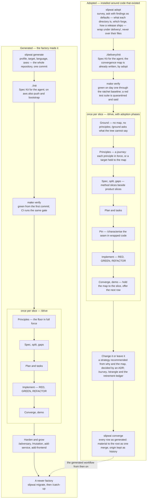

# The two workflows: generated and adopted

A repository reaches this method one of two ways. The factory made it (`slipwai generate`), or somebody else
made it and the method was installed around it (`slipwai adopt`, **experimental** as
[`AGENTS.md`](../AGENTS.md#versioning-is-not-optional) defines the word). Both run the same delivery loop. The difference is
where each starts on the ladders the loop climbs, and what the loop has to do about that.

The adopted column below shows what exists today — every slice of the experimental adoption plan of 2026-09-07 is built, and
`make test-adoption` runs the whole arc on a fixture — as the plan
(comment 190) adds: adoption as a phase of the loop, a living map of where the repository stands, and a
converge step that ends the distinction.

## Generated

1. **`slipwai generate`** asks the profile, the target, the language and the axes, and writes the whole
   repository: `apps/`, `packages/`, `docs/`, `commands/`, `skills/`, `scripts/verify`, the Makefile, and
   `infra/` under the `aws` target. One initial commit on `main`. [Scaffold a new project](generating.md).
2. **`./init`** installs Spec Kit for the chosen agent and projects the skills and commands into it. Under
   `aws` it also pushes and bootstraps, so the push is the first deploy. [Bootstrap Spec Kit](spec-kit.md).
3. **`make verify`** is green from the first commit, and CI runs the same gate. [Gates](verification.md).
4. **`/drive`** runs the ladder for every slice — principles, specification, split, gaps, plan and tasks,
   implement, converge, demo — with the constitution floor in force from the first edit.
   [The delivery loop](delivery-loop.md).
5. **Harden and grow** as slices land: `/adversary`, `/mutation`, the dependency audit; `add-service` and
   `add-frontend`. [Services](services.md).
6. **A newer factory** arrives by `slipwai migrate`, one merge the project decides, then `/catch-up` for what
   a merge cannot do. [Bring a generated project forward](upgrading.md).

## Adopted

1. **`slipwai adopt`** at the root of a clean Git repository. The survey finds every buildable directory with
   its commands, the CI, containers, schema and infrastructure the tree carries; each finding is a question
   with the finding as its default, and the three the tree only sometimes answers — what each directory is,
   which forge runs CI, how a change reaches production today — are asked, proposed only from a file that says,
   and recorded as `unrecorded` where nothing does. The gate's CI configuration is written for the forge found,
   or not at all. Beside the survey it writes the architecture view, `delivery/survey/structure.md`: where
   anything starts, what depends on what (from CodeGraph's index where there is one), where change happens.
   [Adopt an existing repository](adopting.md).
2. **It writes the method under `delivery/`**, beside the code and never over it, and records every wrapped
   application with provenance under `"origin": "adopted"`. One commit by the factory.
3. **`./delivery/init`** installs Spec Kit and the agent projection. The convergence map is already there:
   `adopt` writes `delivery/docs/convergence.md` from the record — every axis at the rung a fact establishes, the
   rung a generated project sits at, and what is planned to move it — `/survey` redraws it, and `verify` fails a
   row the tree contradicts.
4. **`make verify`** is green on day one because `lint`, `typecheck` and `test` run through the ratchet against
   a recorded baseline; a red test suite is quarantined and said on every run, never a red gate on day one.
5. **`/drive`** runs the same ladder with adoption phases woven in. The constitution it ratifies is a journey: the
   template is adapted to the map, a principle the map says is not yet reachable is written as a target under a
   marker, and `check-constitution` holds the marker to the map. Ground comes first — no map, no principles, and
   an unrecorded row on an axis the slice touches is a question before anything else; Pin comes before
   implementing anything in wrapped code, through `/characterise`; after each slice, Convergence holds the map to
   what was done, flips the row a rung was reached on, and offers the next unplanned row as a method slice
   beside the product slices.
6. **Change it, or leave it.** `delivery/docs/change-strategy.md` opens with the strategy `why` and the map
   recommend — *leave it* a first-class answer, rewrite never recommended — and what has to hold before anything
   architectural is worth starting. An accepted ADR with a `Strategy:` line is the decision; `/survey` reads it and
   the map's Strategy row moves. `/strangle` moves one capability at a time only under a decision that says
   `strangler-fig`, and keeps `delivery/retirement.md`.
7. **`slipwai converge`**: when every row on the map reads *as generated* and the tree agrees (`--check` says so
   and why not), the material moves from `delivery/` to the root as one merge, with what the merge cannot carry —
   the survey, the ledgers, the ADRs — moved after it. From then on the repository follows the generated workflow
   above, `migrate` included; `"origin": "adopted"`, the survey and the map stay as history.

## The one difference that matters

A generated project starts at the top of every ladder, and the method's job is to keep it there. An adopted
repository starts wherever it is; the map says where that is, and the loop's job is to climb one rung per
slice until the two workflows are the same thing. Nothing along the way is assumed: what the survey cannot
establish is asked, or recorded as unrecorded and passed with a line saying so — never defaulted.
